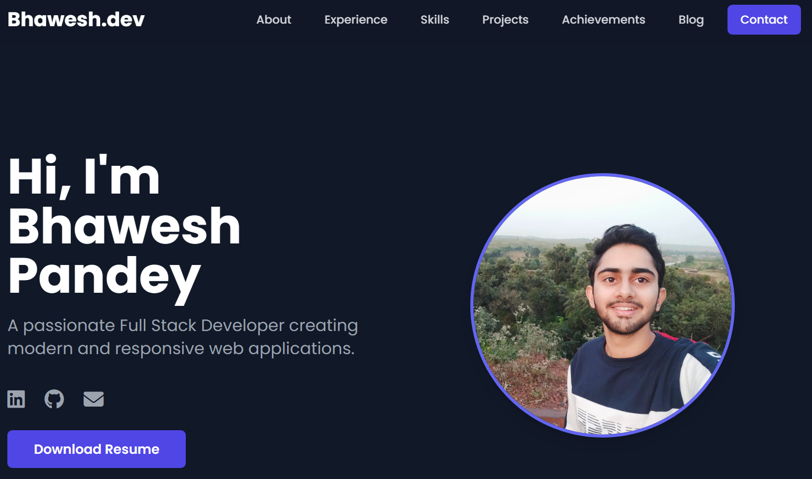

# Personal Portfolio Website

 This is my personal portfolio website, designed to showcase my skills, projects, experience, and achievements. It's a fully responsive, multi-page site built with modern web technologies.

## 🚀 Live Demo

[Personal Portfolio demo](https://portfolio-bhaweshpandey.netlify.app/)

## ✨ Key Features

- **Multi-Page Layout:** Separate, well-organized sections for About, Experience, Skills, Projects, Achievements, Blog, and Contact.
- **Responsive Design:** The entire website is fully responsive and optimized for all screen sizes, from mobile phones to desktops.
- **Interactive Elements:** Includes hover effects on cards, a functional mobile menu, and a working contact form.
- **Modern Tech Stack:** Built with HTML5, and styled with Tailwind CSS for a clean and modern look.
- **Blog with Modals:** A blog section that uses JavaScript to display full posts in clean, pop-up modals.

## 🛠️ Tech Stack

- **Frontend:** HTML5, CSS3, JavaScript
- **Styling:** Tailwind CSS (via CDN)
- **Fonts:** Google Fonts (Poppins)
- **Icons:** Font Awesome
